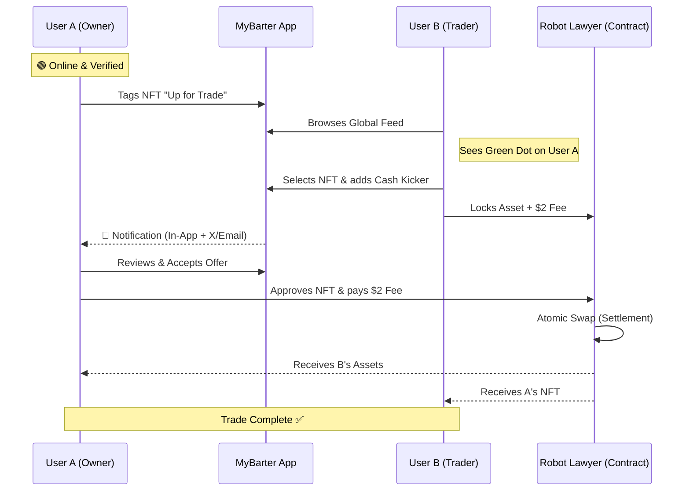

```mermaid
sequenceDiagram
    participant A as User A (Owner)
    participant APP as MyBarter App
    participant B as User B (Trader)
    participant RL as Robot Lawyer (Contract)

    Note over A: 🟢 Online & Verified
    A->>APP: Tags NFT "Up for Trade"
    B->>APP: Browses Global Feed
    Note right of B: Sees Green Dot on User A
    B->>APP: Selects NFT & adds Cash Kicker
    B->>RL: Locks Asset + $2 Fee
    APP-->>A: 🔔 Notification (In-App + X/Email)
    A->>APP: Reviews & Accepts Offer
    A->>RL: Approves NFT & pays $2 Fee
    RL->>RL: Atomic Swap (Settlement)
    RL-->>A: Receives B's Assets
    RL-->>B: Receives A's NFT
    Note over A,B: Trade Complete ✅
```
