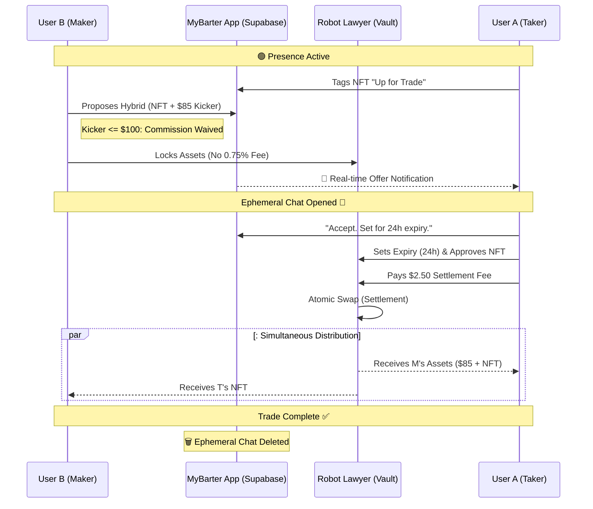

```mermaid
sequenceDiagram
    participant M as User B (Maker)
    participant APP as MyBarter App (Supabase)
    participant RL as Robot Lawyer (Vault)
    participant T as User A (Taker)

    Note over T, M: 🟢 Presence Active
    
    T->>APP: Tags NFT "Up for Trade"
    M->>APP: Proposes Hybrid (NFT + $85 Kicker)
    
    Note right of M: Kicker <= $100: Commission Waived
    M->>RL: Locks Assets (No 0.75% Fee)
    
    APP-->>T: 🔔 Real-time Offer Notification
    
    Note over T, M: Ephemeral Chat Opened 💬
    T->>APP: "Accept. Set for 24h expiry."
    
    T->>RL: Sets Expiry (24h) & Approves NFT
    T->>RL: Pays $2.50 Settlement Fee
    
    RL->>RL: Atomic Swap (Settlement)
    
    PAR: Simultaneous Distribution
        RL-->>T: Receives M's Assets ($85 + NFT)
        RL-->>M: Receives T's NFT
    END

    Note over T, M: Trade Complete ✅
    Note over APP: 🗑️ Ephemeral Chat Deleted
```
