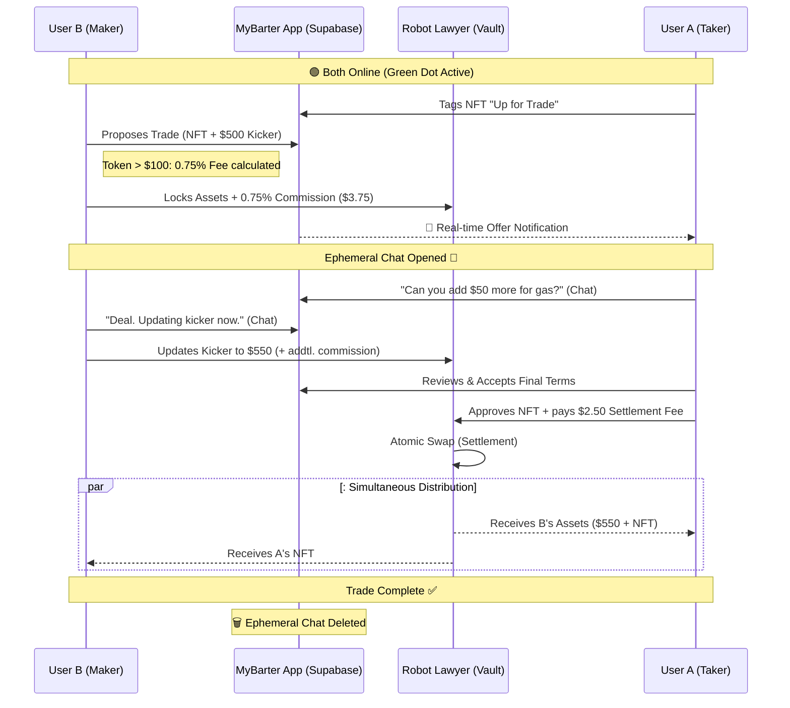

```mermaid
sequenceDiagram
    participant B as User B (Maker)
    participant APP as MyBarter App (Supabase)
    participant RL as Robot Lawyer (Vault)
    participant A as User A (Taker)

    Note over A, B: 🟢 Both Online (Green Dot Active)
    
    A->>APP: Tags NFT "Up for Trade"
    B->>APP: Proposes Trade (NFT + $500 Kicker)
    
    Note right of B: Token > $100: 0.75% Fee calculated
    B->>RL: Locks Assets + 0.75% Commission ($3.75)
    
    APP-->>A: 🔔 Real-time Offer Notification
    
    Note over A, B: Ephemeral Chat Opened 💬
    A->>APP: "Can you add $50 more for gas?" (Chat)
    B->>APP: "Deal. Updating kicker now." (Chat)
    
    B->>RL: Updates Kicker to $550 (+ addtl. commission)
    
    A->>APP: Reviews & Accepts Final Terms
    A->>RL: Approves NFT + pays $2.50 Settlement Fee
    
    RL->>RL: Atomic Swap (Settlement)
    
    PAR: Simultaneous Distribution
        RL-->>A: Receives B's Assets ($550 + NFT)
        RL-->>B: Receives A's NFT
    END

    Note over A, B: Trade Complete ✅
    Note over APP: 🗑️ Ephemeral Chat Deleted
```
